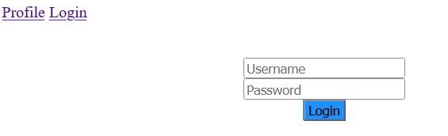
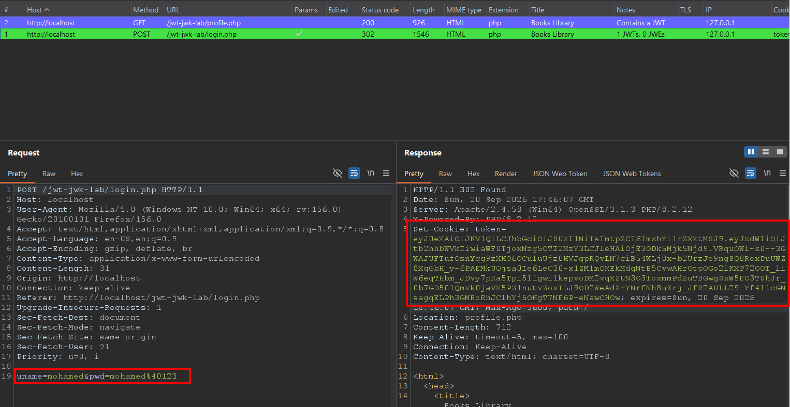
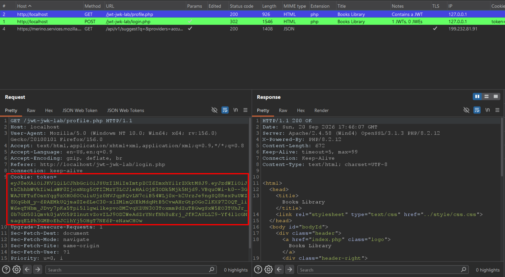
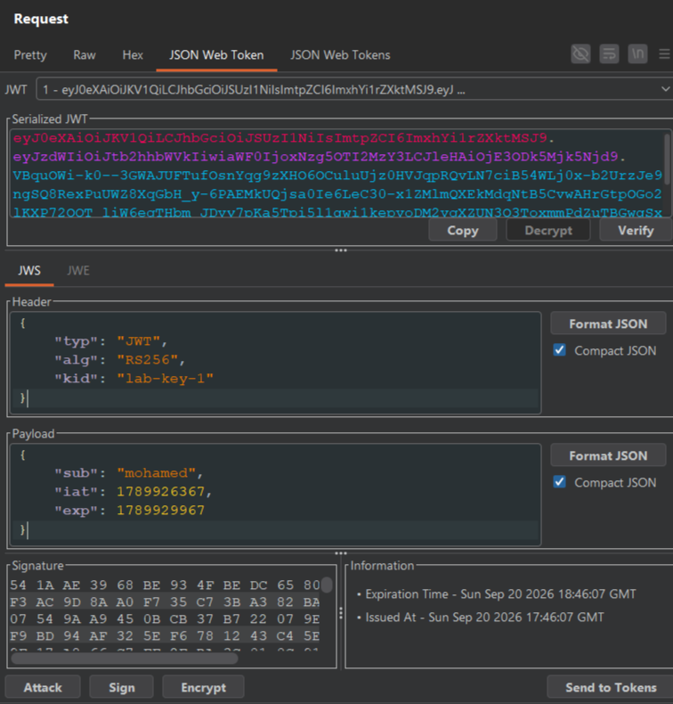
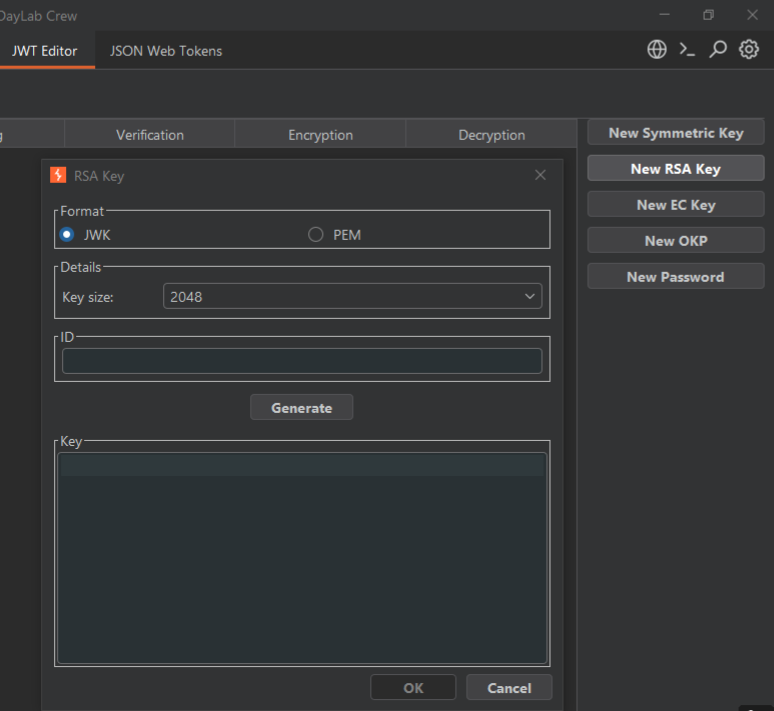
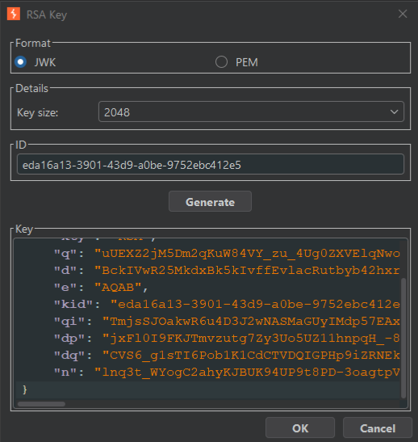
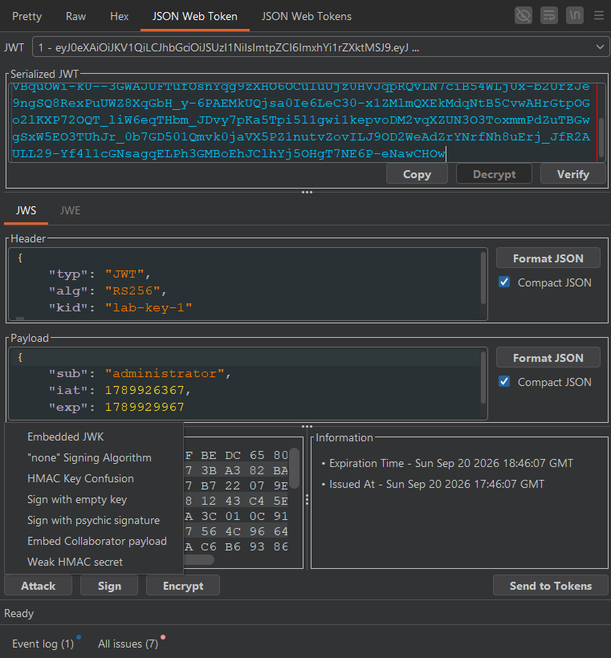
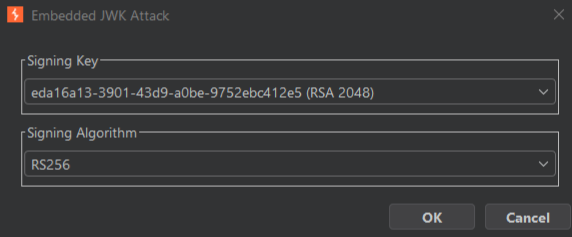
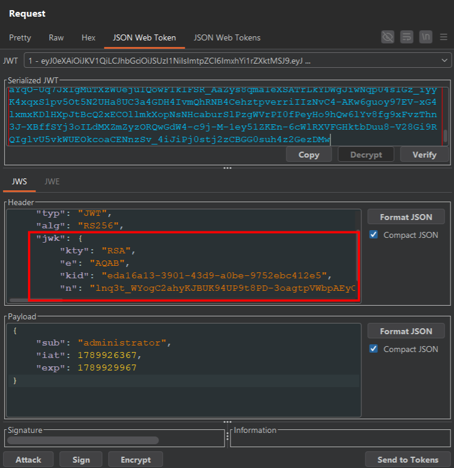

# JWT JWK Injection Lab

This lab is JWT based for handling sessions.

The server supports the `jwk` parameter in the JWT header, which developers use to embed the verification key directly in the token. The problem is that the server trusts any `jwk` parameter it receives, assuming it can only come from the backend itself — when in reality it can be injected and trusted blindly.


## How to Run

Run the lab via Docker.

Start the lab locally using:

```
docker compose up --build
```

The lab port is `8080`.

## My Steps in Solving the Lab

We will be using the JWT Editor extension, so if you haven't downloaded it yet, you should download it from the Extensions tab.

This is our lab:



In this lab we are given a regular user account. Log into the account using the credentials:

```
user: mohamed
pass: mohamed@123
```

After logging in, we're redirected to the profile page, which shows the message "Welcome mohamed":


Our goal in this lab is to exploit the JWK token to escalate our privileges to admin, so that the profile page shows "Welcome administrator" instead.

I'm using Burp as a proxy in my browser, so all requests pass through my proxy history:



Our login request is highlighted by the JWT extension, indicating that it contains a JSON Web Token.

Now look at the POST request to the login endpoint. We send our username and password, and if they're correct, the application sets a session cookie containing the JWT that will be used to authenticate and authorize us on all subsequent requests:



Let's go to our profile page and send the request to Repeater so we can work with the JWT extension:



As shown in the `sub` claim, we're logged in as a regular user, so we need to find a way to alter this token to become an administrator.

There are only two stages of the JWT process we can target: the signing stage and the verification stage.

In this lab, the token is signed with the asymmetric algorithm RS256, so we can't attack the signing stage — the server verifies the signature using its own public key, so any token signed with a different private key would simply fail verification.

That leaves us with the verification stage. However, this stage is performed entirely by the server — unlike signing, we can't manipulate it directly.

The solution for this problem is to manipulate the JWT so that the server ends up verifying the token with a key of our choosing, instead of its own trusted key.

We can achieve this by injecting a `jwk` parameter into the header, which makes the server verify the signature directly with the key we provide.

To carry out this attack, we first need to generate a public/private key pair. In JWT Editor, click "New RSA Key":



The key size doesn't matter here, so just click Generate:



Once the key is generated, click OK.

Back in Repeater, change the `sub` claim to `administrator`, then click the Attack button:



Click "Embedded JWK":



Select the signing key we just generated, then click OK:



Notice that a `jwk` parameter has now been added, containing our public key, while our private key was used to sign the token. When the application receives this token, it will use the embedded public key to check the signature, see that it's valid, and grant us admin access.

Click Send:


As shown, the attack worked successfully.